# Company Profile Website - JYP Tech (Laravel MVC)

## Introduction
A company profile website is a multi-page site that introduces a business to the public - who they are, what they do, and how to reach them. It typically includes a Home page, an About page, a Services page, and a Contact page.

Businesses need a company profile website because it builds credibility, establishes an online presence, and gives potential clients and partners a place to learn about the company and get in touch, even outside of business hours.

The purpose of this project was to apply Laravel MVC (Model-View-Controller) architecture to a realistic, entry-level developer task: building a responsive, multi-page company profile website for a fictional startup, JYP Tech, using Laravel routing, a controller, and the Blade templating engine.

## Objectives
- Explain the MVC architecture used by Laravel.
- Implement application routes for Home, About, Services, and Contact.
- Build a CompanyController to handle each page logic.
- Use Blade templating with a shared layout and reusable navbar/footer components.
- Apply Git version control with meaningful, incremental commits.
- Document the project thoroughly and publish it to GitHub and LinkedIn.

## MVC Architecture
MVC stands for Model-View-Controller. It organizes an application into three responsibilities: Model represents data and business logic (this project does not use a database, so no models were needed). View is what the user actually sees, handled by Blade templates. Controller receives the request from the browser, decides what data is needed, and returns the right view.

Laravel uses MVC because it separates concerns: the logic for handling a request lives in one place (the controller), the presentation lives in another (the views), and the two do not need to know the details of how the other works.

Request flow: Browser -> Route (web.php) -> CompanyController -> Blade View -> HTML Response -> Browser.
 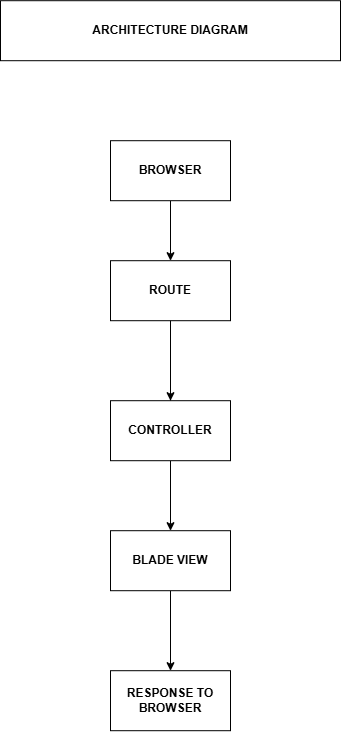

## Laravel Routing
Routing is how Laravel maps a URL the browser requests to the code that should handle it. Each route in routes/web.php matches a URL path to a controller method, using GET requests since the browser is retrieving pages, not submitting data. Each route is also named, which lets Blade views reference routes by name instead of hardcoding URLs.

## Controllers
A controller keeps the logic for handling a request out of the routes file and out of the view. It receives the request, prepares any data the view needs, and returns the correct Blade view. CompanyController has four methods - home, about, services, and contact - each building a small array of data and passing it to its matching view.

## Blade Templating Engine
Blade is Laravel templating engine. It lets views share a common layout and reusable components instead of repeating the same HTML on every page. - @extends tells a page it should be wrapped inside the shared layout. - @section and @endsection define the block of content inserted into the layout. - @yield inside the layout marks where that page-specific content goes. - @include pulls in a reusable Blade component, like this project navbar and footer, so the same markup does not have to be duplicated on every page. Example from this project: @extends('layouts.app') @section('content') Page content goes here @endsection

## Laravel Folder Structure
- app: Application code, controllers and core logic
- routes: Maps URLs to controller methods (web.php)
- resources: Blade views, plus raw CSS/JS source files
- public: The public entry point of the app and compiled assets
- bootstrap: Bootstraps the framework and holds cached files
- config: Application configuration files (database, mail, services, etc.)

## Screenshots
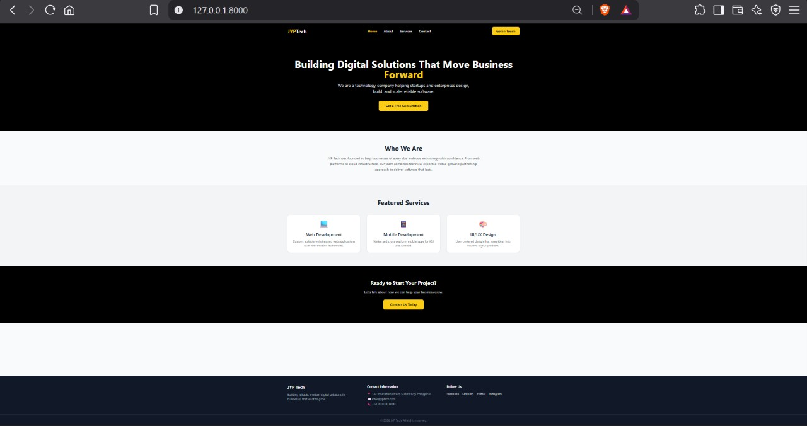 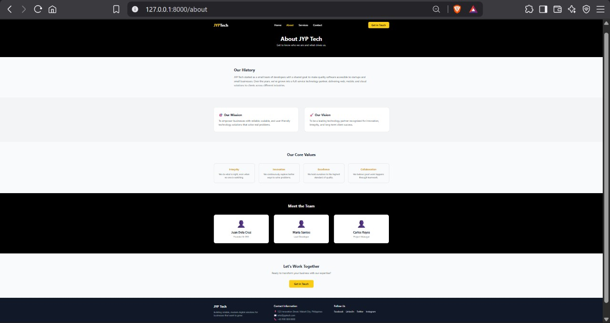 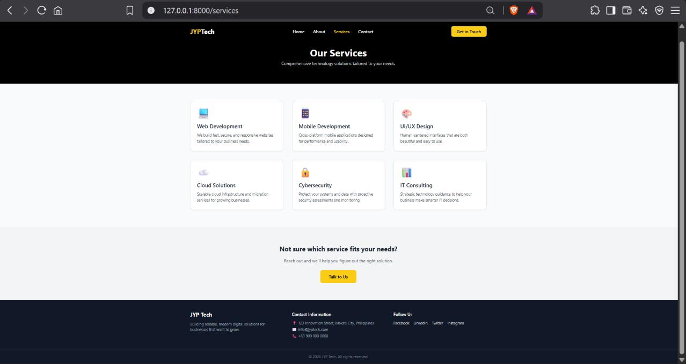 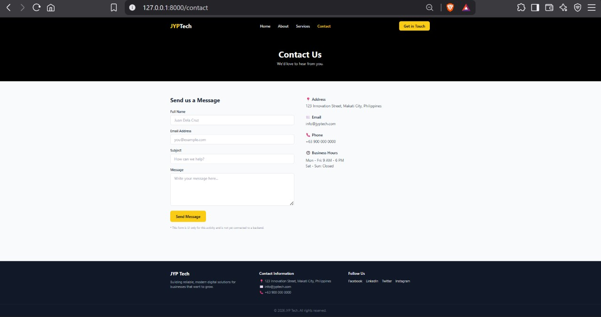 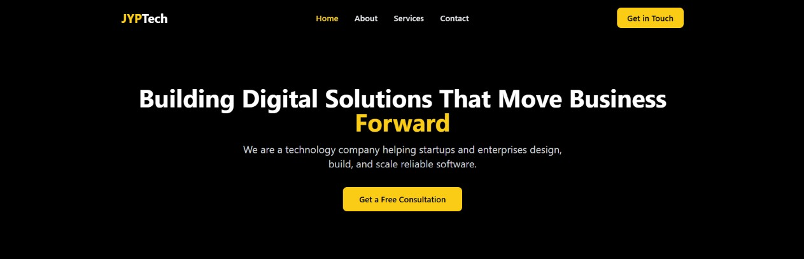 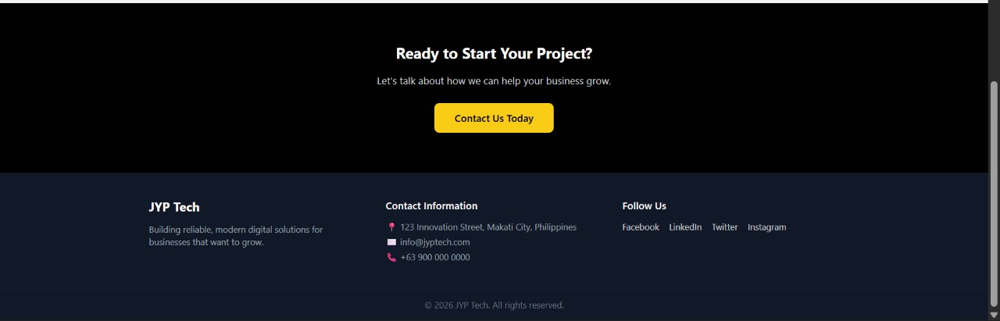 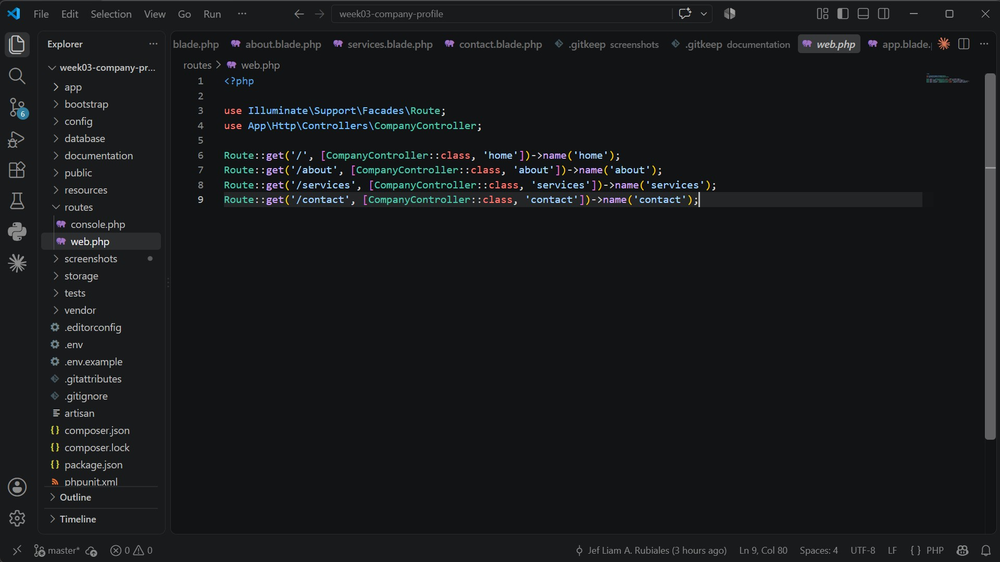 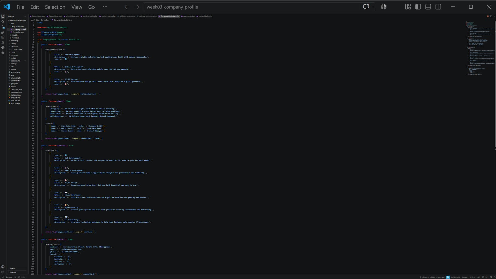 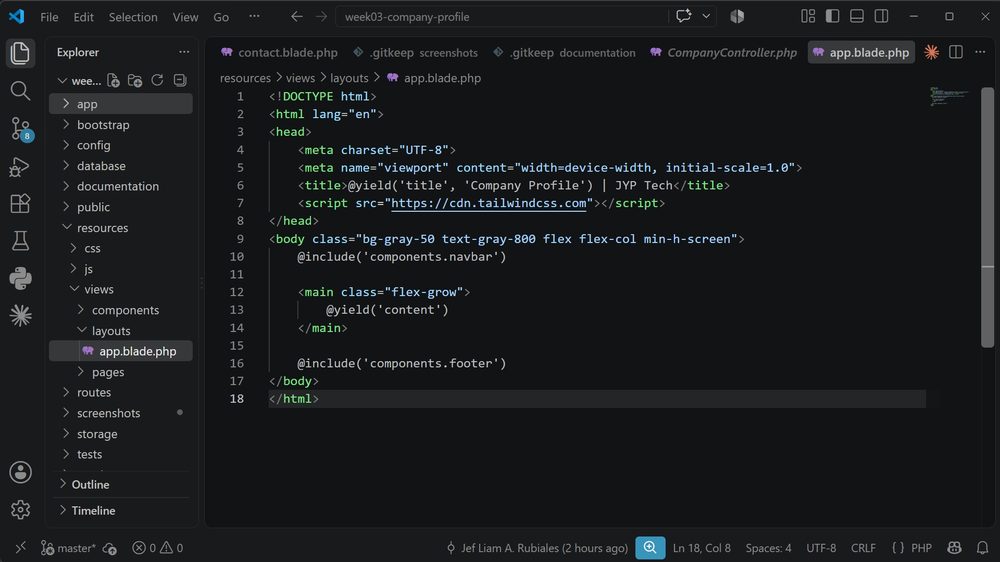 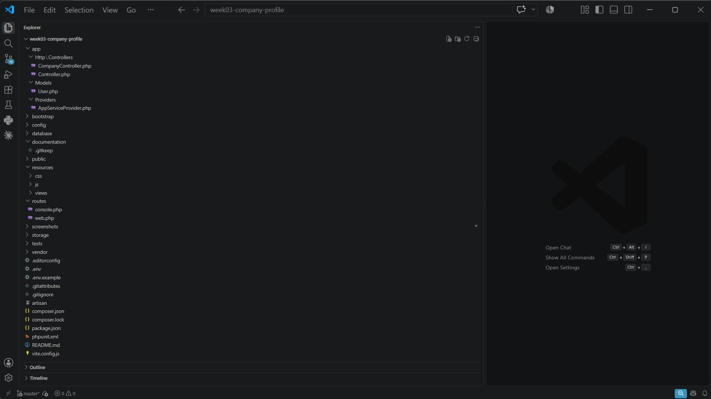

## Problems Encountered
1. Layout file being overwritten unexpectedly - a different version of the layout file with a Vite directive ended up in the layouts folder, causing a ViteManifestNotFoundException since this project uses the Tailwind CDN, not a compiled Vite build.
2. Duplicated or corrupted Blade file content - a couple of page files ended up with leftover text appended after the real endsection tag, causing syntax errors.
3. Stale browser or server state - the browser sometimes showed connection refused or an old cached version of a page after the server had stopped or a file was edited but not saved.

## Solutions
1. Opened the file directly, compared it against the correct version, and did a full replace to restore the intended layout.
2. Cleared the affected files completely and pasted the full correct content in a single paste, then verified the file before testing again.
3. Made a habit of checking that the server was still running before testing, and used a hard refresh in the browser after saving changes.

## Reflection
Building this company profile website gave me a much clearer, hands-on understanding of what MVC actually means in practice, rather than as an abstract diagram. Before this project, I understood MVC as a definition: models hold data, views display things, controllers connect them. Actually wiring together routes, a controller, and Blade views showed me why that separation matters in a way a textbook explanation never could. When my layout file got overwritten with the wrong content partway through the project, the error message pointed straight to the specific view file and line number. That single detail showed me how cleanly Laravel separates concerns: the routing layer did not break, the controller did not break, only the presentation layer did, and I was able to fix it without touching anything else in the application. Separation of concerns turned out to matter in practice, not just in theory. Because CompanyController only handles preparing data and choosing which view to return, and the views only handle how that data is displayed, I was able to redesign the entire color theme of the site, switching every page over to the yellow and black JYP Tech branding, without touching a single line of PHP logic. Similarly, when I found a small spacing bug in the footer, I only had to open one component file to fix it, and that fix applied to every page on the site instantly, because the footer is included once rather than duplicated across four separate page files. That is the real payoff of MVC and reusable Blade components: changes stay contained to the layer they belong to, instead of needing to be repeated everywhere. Working through routes, controllers, and views together also made Laravel request lifecycle feel concrete instead of theoretical. A request starts when the browser asks for a URL. The route file matches that URL to a specific controller method. That method decides what data the page needs and passes it along. Blade then takes that data and renders it into the final HTML the browser displays. Once I could trace an error back through that exact chain, for example tracking a ViteManifestNotFoundException back to one specific line inside my layout file, debugging stopped feeling random and started feeling like following a predictable, traceable path through the application. I can also see clearly how this same architecture scales to larger, enterprise-level systems. A real company platform might have dozens of controllers, hundreds of routes, and a much larger library of reusable Blade components, or full model-backed pages connected to a database, but the underlying principle stays identical: keep routing, business logic, and presentation separate so that a large team can work on different parts of the same application without stepping on each other work. The same reusable component pattern I used for a simple navbar and footer would extend naturally to shared dashboard headers, sidebars, or notification widgets in a much bigger application, and the same benefit applies at any scale: a change in one place does not require hunting down every duplicate copy of that code across the project. Overall, this project turned MVC from something I could define into something I actually understand, by having broken it, watched it fail in a specific and traceable way, and then fixed it myself.

## References
Laravel. Laravel documentation. https://laravel.com/docs

PHP Group. PHP manual. https://www.php.net/manual/en/

Mozilla Developer Network. MDN Web Docs. https://developer.mozilla.org

Tailwind Labs. Tailwind CSS documentation. https://tailwindcss.com/docs
